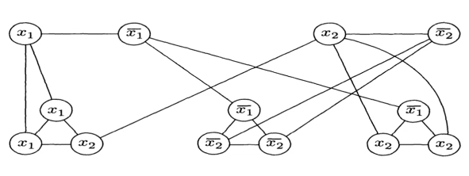
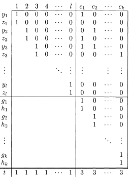
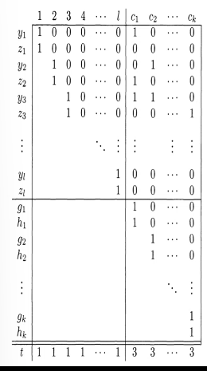

----
  
Date : 27th October 2021, Wednesday  
Topic of Discussion : Examples of proving NP-Completeness 

----

If G is an undirected graph, a vertex cover of G is a subset of the nodes where every edge of G touches one of the other nodes. The vertex cover problem asks wether a graph contains a vertex cover of a specified size :  

VERTEX-COVER =  

----

#### PROOF :
 Here are the details of a reduction from 3SAT to VERTEX-COVER that operates in polynomial time. The reduction maps a Boolean formula   to a graph G and a value k . For each variable x in   , we produce an edge connexting two nodes. We label the two nodes in this gadget  and  . Setting x to be TRUE corresponds to selecting the left node for the vertex cover, whereas FALSE corresponds to the right node. 

Triple of three nodes that are labeled with the three literals of the clause. These three nodes are connected to each other and to the nodes in the variable gadgets that have the identical labels. Thus the total number of nodes that appear in G in 2m + 3l , where  has m variables and l clauses . Let k be m + 2l.  
For example , if    the reduction produces  from  , where k = 8 and G takes the form shown in the following figure. 

    

To prove that this reduction works, we need to show that  is satisfiable if and only if G has a vertex cover with k nodes. We start with a satisfying assignment . 
We first put the nodes of the variable gadgets that correspond to the true literals in the assignment into the vertex cover. Then , we select one true literal in every clause and put the remaining two nodes from every clause gadget into the vertex cover. Now, we have a total of k nodes . They cover all edges within every clause gedget are covered, and all edged between variable and clause gadgets are covered . Hence G has a vertex cover with k nodes. 
Second , If G has a vertex cover with k nodes , we show that  is satisfiable by constructing a satisfying assignment. THe vertex cover must contain one node in each variable gadget and two in every clause gadget in order to cover the edges of the variable gadgets and the three gadgets of the varible gadgets and three edged within the clause gadgets. 
That accounts for all the nodes , so that none are left over. We take the nodes of tha variable gadgets that are in the vertex cover and assign the corresponding literalss TRUE . That assignment satisfies  because each of the three edged connecting the variable gadgets with each clause gadget is covered and only two nodes of the clause gadget are in the vertex cover . Therefore one of the edged must be covered by a node from a variable gadegt and so that assignment satisfies the corresponding clause.  

----

SUBSET SUM = 

----

a 3cnf-formula  we construct an instance of the SUBSET-SUm problem that contains a subcollection summing to the target t if and only if  is satisfiable . Cakk this subcollection T. 

Let  be a boolean formula with variables  and clauses  . 
THe reduction converts  to an instance of the SUBSET-SUM problem   
The table is partially filled in to illustrate sample clauses :
  

    

Thus S contains one pair of numbers  for each variable  in  . The decimal representaion of these numbers are in two parts , as indicated in the table . The left-hand part comprises a 1 followed by l-i 0's. The right hand part contain one digit for each clause, where the jth digit of   is 1 if clause  contains literal  and jth digit of  is 1 if clause  contains literal  . Digits not specified to be 1 are 0. 
  
Additionally , S contains one pair of numbers ,  for each clause  . These two numbers are equal and consist of a 1 followed by k-j 0's  

Finally, the target number t , the bottom row of the table , consists of l 1s followed by k 3s 

    

Suppose that  is satisfiable . We construct a subset of S as follows. We select yi if x_i is assigned is TRUE in the satisfying assignment and z_i  if x_i is assigned FALSE. If we add up what we have selected so far , we obtain a 1 in each of the first l digits because we have selected either y_i or z_i for each i. Furthermore, each of the last k digits is a number between 1 and 3 because each clause is satisfied and so contains between 1 and 3 true literals . Now we further select enough if the g and h numbers to bring each of the last k digits upto 3, thus hitting the target.
 
Suppose that a subset of S sums to t. We construct a satisfying assignment to  after making several observations .  First , all the digits in members of S are either 0 or 1. Futhermore , each column in the table describing S contains at most five 1s . Hence a "carry" into the next column never occurs when a subset of S is added . To get a 1 in each of the first l columns the subset must have either  
 
y_i or z_i for each i, but not both.

Now that we make the satisfying assignment. If the subset contains y_i , we assign x_i TRUE ; otherwise we assign it FALSE . This assignment must satisfy  because in each of the final k columns the sum is always 3. In column c_j , at most 2 can come from g_j and h_j , so at least 1 in this column must come from some y_i or z_i in the subset. If it is y_i , then x_i appears in c_j and is asssigned TRUE , so c_j is satisfied . If it is z_i then   appears in c_j and x_i is assigned FALSE, so c_j is satisfied . THerefore  is satisfied.   

----

* Vertex Cover is NP-complete 
* Subset Sum is NP-complete

----