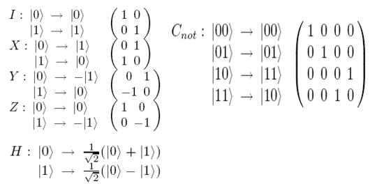

----
<br><br>
Date : 10<sup>th</sup> November 2021, Wednesday<br> 
Topic of Discussion : Quantum Algorithms<br>

----


-*The Three Polarizers*<br>
### The photon experiment
<br><br><br><br>

----


-*An Explantion*<br>

* A qunatum bit, or qubit , is a unit vector in a two dimensional complex vector space for which a particular basis has beed fixed and is denoted by :<br>
,&space;|1>&space;\right&space;\}}" title="{\color{Emerald} \left \{ |0>, |1> \right \}}" /><br>

* Qubits can be in a superposition of |0> and |1> such as &plus;b\;|1>&space;}" title="{\color{Emerald} a\;|0>+b\;|1> }" /> where a and b are complex numbers such that  

----


For the qubit &plus;b|1>&space;}" title="{\color{Emerald} a|0>+b|1> }" /> <br>
the probability that the measured value is |0> is <br>
after which the state collapses to |0> and the probability that the measured value is |1> is <br>
after which the state collapses to |1><br>

----

<br>

-*and several other experiments too!*<br>

Breifly >>> :

* Superposition Postulate
    * State vector in Hilbert space, Tensor analysis

* Measurement & Collapse Postulates
    * Projections, Inner-products etc.

* Evolution Postulate
    * Schrodinger Equation , Unitary Transformations etc.

----


Assume that U is a unitary transforamtion that clones , in that )&space;=&space;|aa>&space;}" title="{\color{Emerald} U(|a0>) = |aa> }" /> for all quantum states |a>.<br>
Consider &space;=&space;(\frac{1}{\sqrt{2}}|a>&plus;|b>)&space;}" title="{\color{Emerald} |c> = (\frac{1}{\sqrt{2}}|a>+|b>) }" /><br>
Then,
)&space;=&space;\frac{1}{\sqrt{2}}(U(|a0>)&space;&plus;&space;U(|b0>))&space;=&space;\frac{1}{\sqrt{2}}(|aa>&space;&plus;|bb>)}" title="{\color{Emerald} U(|c0>) = \frac{1}{\sqrt{2}}(U(|a0>) + U(|b0>)) = \frac{1}{\sqrt{2}}(|aa> +|bb>)}" /><br>
But id U is cloning transformation then
)&space;=&space;|cc>&space;=&space;\frac{1}{2}(|aa>&space;&plus;&space;|ab>&space;&plus;&space;|ba>&space;&plus;&space;|bb>)&space;}" title="{\color{Emerald} U(|c0>) = |cc> = \frac{1}{2}(|aa> + |ab> + |ba> + |bb>) }" /><br>
A contradiction <br>

----


* Individual state spaces of n particles combine classically throuh the cartesian product.<br>
        **Quantum stsaes, however, combine through the tensor product**<br>
* A basis for a three qubit system is 
,&space;|001>,&space;|010>,&space;|011>,&space;|100>,&space;|101>,&space;|110>,&space;|111>&space;\right&space;\}}" title="{\color{Emerald} \left \{ |000>, |001>, |010>, |011>, |100>, |101>, |110>, |111> \right \}}" />
and in general an n qubit system has  basis vectors.

* We can now see the exponential growth of the state space with the number of quantum particles.

----


* The state |00> + |11> cannot be described in terms of its components (qubits) seperately
* We cannot find  such that
&space;&plus;&space;b_1|1>&space;)&space;\bigotimes&space;(a_2|0>&space;&plus;&space;b_2|1>&space;)&space;=&space;|00>&space;&plus;&space;|11>}" title="{\color{Emerald} (a_1|0> + b_1|1> ) \bigotimes (a_2|0> + b_2|1> ) = |00> + |11>}" /><br>
&space;&plus;&space;a_1b_2|01>&space;&plus;&space;b_1a_2|10>&space;&plus;&space;b_1b_2|11>&space;}" title="{\color{Emerald} \;\;\; = a_1a_2|00> + a_1b_2|01> + b_1a_2|10> + b_1b_2|11> }" /><br>
Means  which implies that either  or <br>

States which cannot be decomposed in this way are called **entangled states**

----


Five Simple Quantum Gates and Cnot Gate

<br><br><br><br>

----s


* The objective is to transmit the quantum state of a particle using classical bits and reconstruct the exact quantum state at the reciever.
* Does not contradict no cloning theorem

### The Setting
<br><br><br><br>

Alice has a qubit whose state she dosent know. She wnts to send the state of this qubit &space;&plus;&space;b|1>&space;}" title="{\color{Emerald} \varphi = a|0> + b|1> }" /> to Bob through classical Channels.<br>
Alica and bob possess one qubit of an entagled pair&space;&plus;&space;|11>)}" title="{\color{Emerald} \varphi_0 = \frac{1}{\sqrt{2}}(|00> + |11>)}" /><br>
Initial state is &space;\bigotimes&space;\;(|00>&space;&plus;|11>)&space;\;&plus;b|1>&space;\bigotimes&space;(|00>&space;&plus;|11>)))}" title="{\color{Emerald} \phi \bigotimes \varphi_0 = \frac{1}{\sqrt{2}}(a|0> \bigotimes \;(|00> +|11>) \;+b|1> \bigotimes (|00> +|11>)))}" /><br>
&space;&plus;&space;a|011>&space;&plus;&space;b|100>&space;&plus;&space;b|111>),}" title="{\color{Emerald} \;\;\;\;\;\; = \frac{1}{\sqrt{2}}(a|000> + a|011> + b|100> + b|111>),}" />
of which Alice controls the first two bits and bob controls the last one.<br>
Alice now applies <br><br>
<br>
&space;&plus;&space;a|011>&plus;b|100>&plus;b|111>&space;)}" title="{\color{Emerald} (H\;\bigotimes \; I \;\bigotimes \; I)(C_{not} \;\bigotimes\; I)\frac{1}{\sqrt{2}}(a|000> + a|011>+b|100>+b|111> )}" /><br>
&space;&plus;&space;a|011>&plus;b|110>&plus;b|101>&space;)}" title="{\color{Emerald} (H\;\bigotimes \; I \;\bigotimes \; I)\frac{1}{\sqrt{2}}(a|000> + a|011>+b|110>+b|101> )}" /><br>
&plus;|011>&plus;|100>&plus;|111>)&plus;b(|010>&plus;|001>-|110>-|101>))}" title="{\color{Emerald} \frac{1}{2}(a(|000>+|011>+|100>+|111>)+b(|010>+|001>-|110>-|101>))}" /><br>
(a|0>&space;&plus;b|1>)&space;&plus;&space;|01>(a|1>&plus;b|0>)&space;&plus;&space;|10>(a|0>-b|1>)&space;&plus;|11>&space;(a|1>-b|0>))}" title="{\color{Emerald} = \frac{1}{2}(|00>(a|0> +b|1>) + |01>(a|1>+b|0>) + |10>(a|0>-b|1>) +|11> (a|1>-b|0>))}" /><brs>

* Alice measures the first two qubits
* She obtains one of the four outputs with equal probability. ALice sends the result of her measurement as two classical bits to Bob
<br><br><br><br>
* When bob recieves the two classical bts from Alice he knows how the state of  his half of the entangled pair compares to the original state of Alice's qubit
* Bob can reconstruct the original state of Alice's qubit, , by applying the appropriate decoding transformation to his part pf the entangled pair as follows :
<br><br><br><br>

----


* Three polarizers experiment 
* Qubits
* Postulates of Quantum Mechanics
* No-CLonin Theorem
* Quantum Teleportation

----

----
<br><br>
Date : 13<sup>th</sup> November 2021, Saturday<br> 
<!-- Topic of Discussion : Quantum Algorithms<br> -->

---- 

<br>

<br>

1. Factoring is reduced to finding a nontrivial square root of 1 modulo N
2. Finding such a root is reduced to computing the order of a random integer modulo N
3. The order of an integer is precisely the period of a particular periodic superposition
4. Finally , periods of superpositions can be efficiently found by tht quantum FFT.

-*Lemma* : If x is a nontrivial square root of 1 modulo N, then gcd(x+1, N) is a nontrivial factor<br>

 implies that N divides    <br>  
 <br>
Therefore N must have a nontrivial factor in common with each of (x+1) and (x-1)<br>

Example . Let N = 15. Then  but . But gcd(4-1, 15) = 3 and gcd(4+1, 15) = 5 are non-trivial factors of 15.<br>

----

<br>

-*Reducing nontrivial square root of 1 to computing teh order modulo N*

Order(x) : the smallest positive integer r such that <br> 
*  Choose a random x. Assume gcd(x, N) = 1 
*  If r, the order of x, is even then a nontrivial square root of 1 is : 

Example : If x = 2 and N = 15 , then the order of 2 is 4 since   .
Raising 2 to half this power, we get a nontrivial root of 1  :  . So we get a divisor of 15 by computing gcd(4+1, 15) = 5<br>

----

<br><br>

-*The order of an integer is precisely the period of a particular periodic superposition.*

<br>

If r is the order of x, then f(0) = f(r) = f(2r) = .... = 1<br>
f(1) = f(r + 1) = f(2r + 1) = .... = x<br>
Thus f is periodic, with period r<br>

<br>

n Qubits = superposition of their  possible states!<br>
}" title="\large {\color{Emerald} \sum_{x \in \left \{ 0,1 \right \}^n} \alpha_x |x>}" /><br>

<br><br><br><br>

The middle steps are all simple unitary transformations<br>

<br>

By linearity :<br>
<br><br><br><br>

### Setting up the periodic Superposition 

* Compute with U_f where:<br>
}" title="\large {\color{Emerald} \sum_{a=0}^{M-1} \frac{1}{\sqrt{M}}|a, f(a)>}" /><br>

* Measure the second register. This gives a periodic superposition on the first register, with period r, the period of f.

<br><br><br><br>

<br>

The state after this measurement clearly shows the periodicity of f<br>

----

<br><br>

-*Quantum Fourier Transformation (QFT)*

### Fourier transform of a periodic vector
&space;=&space;\sum_{j=0}^{M/k&space;-&space;1}&space;\sqrt{\frac{k}{M}}&space;\;\;|jk>}" title="\large {\color{Emerald} |\alpha > = \sum_{j=0}^{M/k - 1} \sqrt{\frac{k}{M}} \;\;|jk>}" /><br><br>
Fourier Transform &space;=&space;(\beta_0,&space;\beta&space;_1,&space;....,&space;\beta_{M-1})}" title="\large {\color{Emerald} |\beta > = (\beta_0, \beta _1, ...., \beta_{M-1})}" /><br><br>
&space;=&space;\frac{1}{\sqrt{k}}&space;\sum_{j=0}^{k-1}&space;|\frac{jM}{k}>}" title="\large {\color{Emerald} |\beta > = \frac{1}{\sqrt{k}} \sum_{j=0}^{k-1} |\frac{jM}{k}>}" /><br><br>

*Proof* : 
<br><br>
The summation is a geometric series ,<br>
If the ratio isn't 1 :  <br>
Therefore  is  if M divides jk, and is zero otherwise.<br>

<br><br><br><br>

Probability distribution of the quantum state after Fourier Transformation<br>

### Finding the period via fourier Transform 

*Lemma* Suppose s independent samples are drawn uniformly from 
<br>
Then with probability at least  , the greatest common divisor of these samples is M/k<br>

----

## Efficient QFT
<br><br>


```
function FFT(a,w)
Input : An array a = (a_0, a_1, ..., a_n-1), for n a power of 2 
        A primitive nth root of unity , w
Output : M_n(w) a

if w = 1: return 1
(s_0, s_1, ......., s_n/2 - 1) = FFT((a_0, a_2, ....., a_n-2), w^2)
(s'_0, s'_1, ......., s'_n/2 - 1) = FFT((a_1, a_3, ....., a_n-1), w^2)

for j = 0 to n/2 - 1 :
    r_j = s_j + w^j.s'_j
    r_j + n/2 = s_j - w^j.s'_j 
return (r_0, r_1, ...., r_n-1)

```

<br>

<br><br><br><br>
<br><br><br><br>

T(n) = 2T(n/2)+O(n)<br>
O(log^2 M) quantum operations<br>

<br>

QFT = <br><br>

### CODE

Input : an odd composite integer N<br>
Output : a factor of N<br>


1. Choose x uniformly at random in the range 
2. Let M be a power of 2 near N
3. Repeat s = 2logN times :

Start with two quantum registers, both initially 0, the first large enough to store a number modulo M and the second modulo N.<br>
Compute  using a quantum circuit , to get the superposition 
}" title="\large {\color{Emerald} \sum_{a=0}^{M-1} \frac{1}{\sqrt{M}} |a, x^a \; mod \; N>}" /><br>

Measure the second register. Now the first register contains the periodic super-position &space;\;&space;=&space;\;&space;\sum_{j=0}^{M/r-1}&space;\frac{\sqrt{r}}{\sqrt{M}}&space;|jr&space;&plus;&space;k>}" title="\large {\color{Emerald} |\alpha> \; = \; \sum_{j=0}^{M/r-1} \frac{\sqrt{r}}{\sqrt{M}} |jr + k>}" /> where k is a random offset between 0 and r-1 (recall that r is the order of x modulo N).<br>

Fourier sample the superposition }" title="\large {\color{Emerald} |\alpha >}" /> to obtain an indexx between 0 and M-1<br>

Let g be the gcd of the resulting indices <br>

4. If M/g is even , then compute  and output it if it is a nontrivial factor of N, otherwise return to step 1.

----


