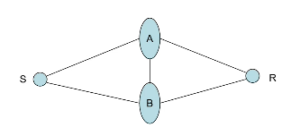

----
  

Date : 20th November 2021, Saturday  
Topic of Discussion : BYZANTINE AGREEMENT -*possibility & Protocols* 

----

Simulting broadcast in P2P networks 

  
Real network 
  
To overlay : Brodcast channel from S to all  

----

 

Each process starts with an input from a fixxed set V = {0,1}. The goal is for the players to eventually output decisions from the set V upholding the following conditions , even in the presence of an adversary that can Byzantinely corrupt up to any t of the n players :  

* Agreement : All non faculty processes decide on teh same vlaue u in V
* Validity : If all non-faculty processes start with the same initial value u in V , then u = v
* Termination : All non faculty processes eventually decide.

----

<table class="tg">
<thead>
  <tr>
    <th class="tg-68ks">Network Model</th>
    <th class="tg-68ks">IPC : Undirected graphs, Diagraphs, Hypergraphs (Radio networks etc.), Quantum Networks   Timing : Synchrony, Asychrony, Partial Synchrony</th>
  </tr>
</thead>
<tbody>
  <tr>
    <td class="tg-03cz">Protocol Model</td>
    <td class="tg-03cz">Basic Postulates / Assumptions : Determinstic/Randomized protocols (interactive PPTM's) , Quantum Protocols   Composability : Stand-alone, sequentially composable, concurrently composable, universally composable</td>
  </tr>
  <tr>
    <td class="tg-03cz">Adversary Model</td>
    <td class="tg-03cz">Computational Power : PPT, unbounded power   Corruption type : Passive, fall - stop, Byzantine   Corruption capacity : threshould, non-threshould   Mobility : Static, Adaptive, Mobile</td>
  </tr>
  <tr>
    <td class="tg-03cz">Security Model </td>
    <td class="tg-03cz">Perfect, Unconditional, Statistical, Computational Security</td>
  </tr>
  <tr>
    <td class="tg-03cz">Inquiry / Objective</td>
    <td class="tg-03cz">Definition, Possibility , Feasibility, Optimality of solutions</td>
  </tr>
</tbody>
</table>

----

  
  

----

The procedure consists of exchange of messages, followed by computation of interactive consistency vector on the basis of result of exchange. 
Two round of information of exchange is required :  
* In the first round the processes exchange their input values
* In the second round they exchange all the values obtained in the first round.

----

<table class="tg">
<thead>
  <tr>
    <th class="tg-68ks">V11</th>
    <th class="tg-68ks">V12</th>
    <th class="tg-68ks">V13</th>
    <th class="tg-68ks">V14</th>
  </tr>
</thead>
<tbody>
  <tr>
   <th class="tg-68ks">V21</th>
    <th class="tg-68ks">V22</th>
    <th class="tg-68ks">V23</th>
    <th class="tg-68ks">V24</th>
  </tr>
  <tr>
   <th class="tg-68ks">V31</th>
    <th class="tg-68ks">V32</th>
    <th class="tg-68ks">V33</th>
    <th class="tg-68ks">V34</th>
  </tr><tr>
   <th class="tg-68ks">V41</th>
    <th class="tg-68ks">V42</th>
    <th class="tg-68ks">V43</th>
    <th class="tg-68ks">V44</th>
  </tr>
</tbody>
</table>

Vij is the message that player I says it recieved from player 
The message matrices differ across players by at most one row & corresponding column. 

----

* Processes are suplemented with "magical powers" to authenticate their communication - DIgital Signatures
* Pease et. al. showed that using authentication, fault tolerance can be increased to t < n.

In a (synchronous) P2P network of n nodes, t of which are (Byzantine) faulty, consensus/ agreement is possible only if the network is **(2t + 1)** connected 

With cryptography: (t + 1) connectivity is sufficient  

  

In a (synchronous) P2P network of n nodes, t of which are (fail-stop / Byzantine) faculty , consensus requires > t rounds , in the worst case. 

----

 

* Blockchain Based
    * Proof-of-work
    * Proof-of-Stake
    * etc.
* Quantum Byzantine Agreement

----