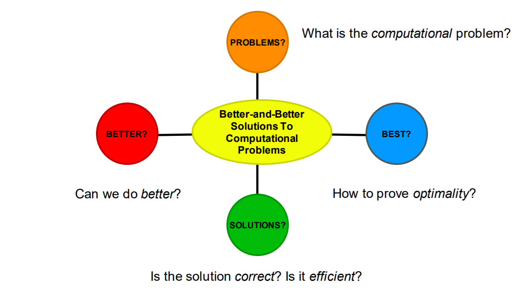
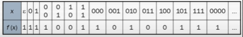
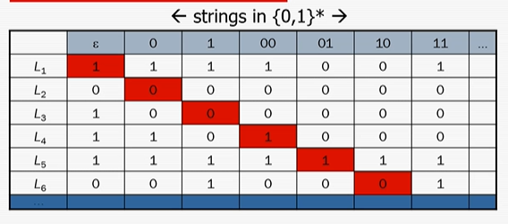
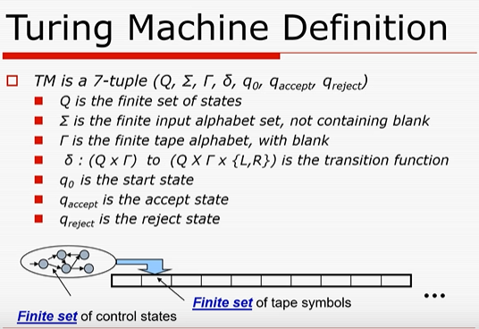

# WEEK 1
---- 
## Lecture 1
----
Date : 18th August 2021 <br> 
Topic of discussion : Computational Problems and their solutions <br>
* "Problems" : Exemplary Challenges in Understanding <br>
 <br>

### What are Problems ?
We first think of 4 different ways possile to define Problems
```
1. Is it a Computational Problem 
2. Infinite ways of Posing the same problem 
3. The problem of "posing the problem without solving it" 
4. What kind of tools are given / permitted to the solver ?
```
--> Exemplary Challenges in Understanding the "PROBLEMS"

### Problems as Membership queries in languages
Decision problems and (No ?) loss in generality is the point of discussion here<br>

### Decision Problems 
--> Here Output is a single bit (True or False)<br>
Each decision problem is characterized by a subset of the set of all possible inputs (that is subset of, say {0,1}* ) <br>
```
INPUT : String x,
OUTPUT : YES If x in language L , else NO 
```
### EXAMPLES
```
1. Primality Testing PRIMES : {n | n is prime }
2. Graph connectivity GC : {Graph G | G is connected }
3. Boolean Satisfiability SAT : {CNF | Boolean formula f | f is not a fallacy ; i.e., f is satisfiable}
```

here To summarize , we know what we mean by (sequential and decisional ) computational PROBLEMS <br>
### AXIOMS OF COMPUTATION 
* It takes a non-zero time to retrive data from far-off locations 
    - Machines are not Omnipresent
* Only finite information can be stored / reviewed from infinite volume 
    - Machines are not Omniscent
* A finite length of code only exerts finite amount of control
    - Machines are not Omnipotent

now To summarize , we know what we mean by (sequential) solutions or algorithms <br>
### COMPARING SOLUTIONS 
* How to compare Various solutions i.e., finding out the better solution 
    ```
    What is time taken by the algorihtm
    What is the space occupied by the algorithm
    Worst-case Analysis ? Or else ??? 
    Asymptotic analysis ? But why
    ```

Exemplary Challenges in Understanding "BETTER" Solutions in the Sequential Setting <br>

### THE THREE LEARNING TECHNIQUES 
1. Self Discovery --> No communication
2. Reading and Understanding --> One way comunication 
3. Brainstorming in Teams --> Two way communication

----
## Lecture 2
----
Date : 21 August 2021<br>
Topic of discussion : Computational problems that computer cannot solve<br>
### Countability VS Computability
COUNTABLE SETS : An infinite set is countable if there is a bijection f : N --> S from the natural numbers to S. <br>
**Backbone to the Argument:** Non countable sets dosent have the ability to enumerate  <br>
Starting to Prove that the total number of computer programs is countable.<br>
Assumption : computer programs --> C programs --> Number of C programs are countable<br>
**THEOREM** : *The set of finite length bit strings {0,1}** *is countable*<br>

### Proof of Countability of {0,1}* 
Intutuively we can strike up the 1 to 1 correspondence f : N --> {0,1}* by listing the strings in short-lex order 

**Uncountable Sets:**
A set is uncountable if it is not countable 
**Theorem :** The power set of bit strings P({0,1}*) is uncountable 

### Proof of Uncountablility of P({0,1}*)
Any subset T in P({0,1}*) can be viewed as a function f : {0,1}* -->  {0,1}. This is done by making the function take the value 1 for elements in the set, and the value 0 for elements not in set<br> 
<br>

**Uncountability of P({0,1}*)** : <br>
Suppose that P({0,1}*) were countable 
Thus now it will possible to find a bijection from N to P({0,1}*)
hence we can list all binary languages as a sequence L1, L2, L3, L4, L5, ..... supposedly containing every language of bit strings 

<br>

### Uncountability of P({0,1}*) Cantors Diaboical Diagonal :
Cantor's diabolical diagonalization argument creates a languange L thats not on the list THis proves that the P({0,1}* ) is not countable  

L is created as follows :<br>
    The j<sup>th<sup> column of L is the opposite of the j<sup>th<sup> column of the j<sup>th<sup> row L<sub>i<sub> . In other words, L is the anti-diagonal of the table <br>

This guarentees that L disagrees with every listed language (L<sub>i<sub>  differs in the i<sup>th<sup> column )   

### The connection to  computing 
*Theorem:* There are computational problems that computers cannot solve !<br>
*Idea of Proof:* We show that there are many more computational problems than computer programs <br>
#### Set of all programs is countable
Every computer program can be encoded in binary by some string
Consequently the cardinality of the set of programs is no greater than that of {0,1}* <br>
as {0,1}* is countable <br> 
As we defined that the Problems are (membership queries in Languages)<br>
Hence ,  the set of all problems has the same cardinality as P({0,1}*) <br>
but where as P({0,1}* ) is uncountable <br>
```
Only existence of non-computable problems is proved . Are we lucky enough that only escortic problems are in this category and practically most of not all useful problems are countable ??
Unfortunately No!! 
Proving this thing ...
More "Heavier" use of diagonalization !!
```

*Postscript :* This is a limitation not only the current computer programs but it is also TRUE for every futuristic computer too!!

### CHURCH-TURING HYPOTHESIS
Algorithms --> The turing machine <br>
**Attributes of machines** <br>
* Machines are Not Omnipresent 
    - It takes non-zero time to retrive data from far-off locations 
            "Very Large" memories are inherently sequential
* Machines are Not Omniscent 
    - Only finite information can be stored / retreived from finite volume 
            FInite set of tape symbols
* Machines are Not Omnipotent
    - A finite length code only exerts finite amount of control 
            finite set of tape symbols and control sets

### THE TURING MACHINE 
The turing machine definition is given below :<br>
<br>
*C programs are turing complete* <br>
No C-program exists --> No ALgorithm/Machine exists ! <br>
We will work pseudo-level code which are much higher than even C-programs <br>
