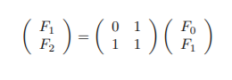
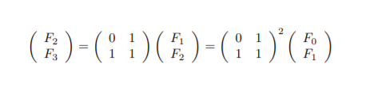
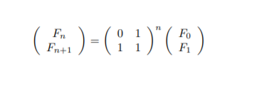
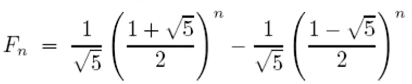
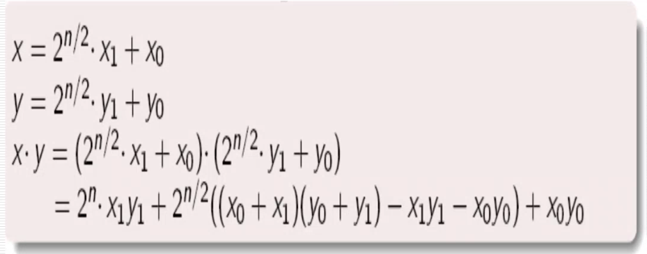
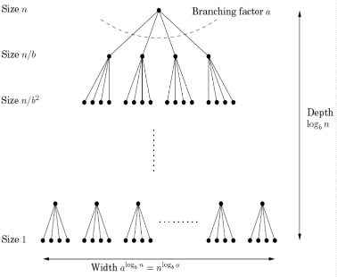

# WEEK 2
## Lecture 1
Date : 25th August 2021<br>
Topic of discussion : Multiple ways to solving tractable problems<br>
**Question** : Computing the n<sup>th</sup> fibonacci number F<sub>n</sub><br>
 
F<sub>n</sub> = F<sub>n-1</sub> + F<sub>n-2</sub> if n > 1
              
              = 1 if n = 1
              
              = 0 if n = 0

**Problem** : *Input* : n and *Output* : F<sub>n</sub>

Points to be noted in any algorithm
* Is the algorithm correct
* Time taken to complete the algorithm with input-size n
* Is there any possible way to make a better algorithm, If yes , How ?

### Algorithm #1 for F<sub>n</sub>
    function fib1(n):

    if n = 0: return 0
    if n = 1: return 1
    return fib1(n-1) + fib1(n-2)

Analysis of the above code :

*Explanation:* The function returns '0' if the Input 'n' is '0' and  returns '1' if the Input 'n' is '1' , returns the sum of previous two numbers in the sequence 

*Correctness:* No memory Issues

*Time complexity:* 
T(n) <= 2 for n <= 1 , T(n) = T(n-1) + T(n-2) +3 for n > 1 i.e.,  
T(n) >= F_n


### Algorithm #2 for F<sub>n</sub>
    function fib2(n):

    if n = 0: return 0
    #creating an array f[0..n]
    f[0] = 0, f[1] = 1
    for i = 2....n :
        f[i] = f[i-1] + f[i-2]
    return f[n]

Analysis of the above code :

*Explanation:* We try to use Iteration in this algorithm such that it completely removes the overlapping computations in the recursion 

*Correctness:* No memory Issues

*Time complexity:* 
It apears to be a linear-time algorithm.. but it is not a linear-time algorithm as F<sub>n</sub> is 0.694n bits long and Each addition will be O(n) steps !! i.e.,
Overall runtime complexity is **O(n^2)** steps

### Algorithm #3 for F<sub>n</sub>

Analysis of the above code :

As : 

 

Similarly: 



Consequently : 




*Explanation:* We are trying to find wether there is a solution faster than Iteration 

*Correctness:* No memory Issues

*Time complexity:* 
Overall runtime complexity is **O(M(n)log(n))** is the complexity of multipling two n-bit integers

#### Comparing Algorithm #3 and #2 
As the better solution is the one with less runtime complexity so the Algo #3 is the better one when compared 

### Algorithm #4 

Direct  Formula : 

 

The derivation of the formula:
Assume that F<sub>n</sub> is some r<sup>n</sup> then r<sup>n</sup> = r<sup>n-1</sup> + r<sup>n-2</sup> and r<sup>2</sup> = r + 1  as it is a quadratic equation we can solve for r then lets roots be **a** and **b** then by deductions we get to the r<sup>n</sup> as p(a)<sup>n</sup> - q(b)<sup>n</sup> and p=q by this we get the direct formula given above

**Question** : Algorithm for multiplying Large integers => *Karatsuba Algorithm*

Primary school solution : *Time complexity* : O(n)<sup>2</sup> 

where this is not the best solution for the above quesiton...

Ex : 

 Multiplication of two complex numbers : (a+ib)*(c+id) = (ac-bd) +i(ad-bc) 
 
  Number of real multiplications needed in this : **4** 


Trying to deduce this we get :
 
Find ac-bd and ad + bc :
* find a.c
* find b.d
* find (a+b).(c+d)

As **(ad + bc) = (a + b).(c + d) - ac -bd**

By this we get an Idea of *DIVIDE AND CONQUER* as mentioned below
 
To multiply two n-digit integers:
* add two n/2 digit integers
* multiply threee n/2 digit integers
* add , subtract, and shift n/2 digit integers to obtain result

as follows : 



Theorem : 
Can we multiply two n-bit integers in O(n<sup>1.585</sup>) bit operations

T(n) <= T(n/2)+T(n/2)+T(1+n/2)+O(n)

T(n) = O(n<sup>log<sub>2</sub>3</sup>) = O(n<sup>1.585</sup>)

There are logarithms which can do multiplication operations better than O(n<sup>1.585</sup>) such as Fast Fourier Transform (FFT) with O(nlogn loglogn) and other fastest method is with time complexity : O(n logn 2<sup>O(log*n)</sup>)

Fastest known : O(n logn) <br>
----
## Lecture 2
----
Date : 28th August 2021 <br>
Topic of discussion : Divide and Conquer, Merge Sort , Strasen's matrix Multiplication , Order statistics , Master theorem <br>
If     for some constants a > 0, b > 1, and d >= 0<br>
then<br>
&space;log_b&space;a}" title="\large {\color{Emerald} T(n) = O(n^d) \; \; \; \; \; \; \; \; \; if d > log_b a}" /><br>
<br>
<br>

### Proof 
<br>
Work done at k<sup>th</sup> level <br>
<br>
Total work done : summation of the geometric series with ratio  and first term n<sup>d<sup><br>

### THE THREE CASES :
1. The ratio is less than 1
    Then the series is decreasing, adn its sum is just given by its first term,  .
2. The ratio is greater than 1.
    Then series is increasing and its sum is given by its last term,  : <br>
     <br>
    3. The ratio is exactly 1
        In this case all O(log n) terms of teh series are equal to  
----
### Problem : Sort a list of n numbers 
* Split the list into two equal halves
* Recursively sort each half
* Then merge the two sorted sub-lists

*Text book solution*: <br>
```
function mergesort (a[1,2,.....n])
Input : AN array of numbers a[1,2,....n]
Output : A sorted version of this array 

If n > 1:
    return merge(mergesort(a[1.....n/2]), mergesort(a[n/2+1......n]))
else:
    return a

function merge (x[1....k], y[1.....l])
if k = 0 : return y[1....l]
if l = 0: return x[1....k]
if x[1] <= y[1] :
    return x[1]@ merge(x[2....k], y[1.....l])
else :
    return y[1]@ merge(x[1....k], y[2......l])

where here @ symbol is just used to denote concatenation has no other specific meanings in this case
```

* This merge procedure does a constant amount of work pre recursive call
* O(K+1) number of cells
* THus merge is linear in n
* Overall time taken by mergesort is :
    T(n)  = 2T(n/2) + O(n) or O(n log n)

### ITERATIVE MERGESORT 
```
function iterative-mergesort(a[1,.....n])
Input : elements a1,a2,a3...an to be sorted 

Q=[  ] ( empty queue)
for i = 1 to n :
    inject (Q, a[i])
while |Q| > 1 :
    inject (Q, merge(eject(Q), eject (Q)))
return eject (Q)
```


*   There are n! permutations (say ordered from 0 to n!-1)
*   If a sorting algorithm did  k comparisions to sort any set of n numbers, then we may use it to represent the numbers between 0 to n!-1 using k nits
*   Consequently , k is at least log<sub>2</sub>(n!)

### Merge sort is optimal 
<br>

### Matrix multiplication 
* Naive : O(n<sup>3</sup>)
* Strassen : O(n<sup>log7</sup>)
* Fastest known : O(n<sup>2.37</sup>)
* Optimum : Open

### DIVIDE AND CONQUER
### STRASSEN ALGORITHM

P<sub>1<sub> = A(F - H)<br>
P<sub>2<sub> = (A + B) H<br>
P<sub>3<sub> = (C + D)E<br>
P<sub>4<sub> = D(G - E)<br>
P<sub>5<sub> = (A + D)(E + H)<br>
P<sub>6<sub> = (B - D)(G + H)<br>
P<sub>7<sub> = (A - C )(E + F)<br>
<br>
<br>