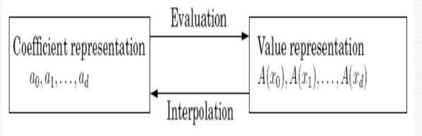

# WEEK 3
## Lecture 1

Topic of discussion : FAST FOURIER TRANSFORM (FFT)

#### Review of Divide and conquer 
**Question** : Polynomial Multiplication

Given two polynomials A(x) and B(x) with degree 'd' as A(x) = a0 + a1x + a2x2 + ... + adxd and B(x) = b0 + b1x + b2x2 + ... + bdxd and the C(x) be the multiplication of A(x)*B(x) as
C(x) =  A(x)*B(x) = c0 + c1x + c2x2 + ... + c2dx2d then ck = a0bk + a1bk-1 + ....... + akb0 

By applying the formula directly we get the time complexity : **O(d^2)** steps but by applying FFT we can reduce the time complexity to the **O(d log d)** 

**First Cut Solution** :
Input : Coefficient of two polynomials, A(x) and B(x), of degree d
Output : Their product C = A . B
Selection : Pick some points x0 , x1 + x2 ... + xn-1 , where n >= 2d+1
Evaluation : compute A(x0) + A(x1), .... A(xn-1) and B(x0) + B(x1), .... B(xn-1) 
Multiplication : Compute C(xk) = A(xk)B(xk) for all k = 0,...n-1
Interpolation : Recover C(x) = c0 + c1x + ...... + c2dx2d

EVALUATION : Split d-Degree polynomial into two d/2 Degree polynomials : Its odd and even powers

As A(x) = Ae(x2) + xAo(x2)

where Ae(.), with the even-numbered coefficients, and Ao(.), with the odd-numbered 

A(xi) = Ae(xi2) + xiAo(xi2)

A(-xi) = Ae(xi2) - xiAo(xi2)

In other words , evaluating A(x) at n paired points +x0,-x0 ...... +xn/2 - 1, -xn/2 - 1 reduces to evaluating  Ae(x) and A0(x) (which each have half the degree of A(x)) at just n/2 points , x02,.... xn/2 - 12

By recursion : 

    T(n) = 2T(n/2) + O(n)

but there comes a problem x02,.... xn/2 - 12 aren't plus/minus pairs implies --> **no recursion!!**

so trying to use the complex nth roots of unity which are 1, w, w2, ... wn-1

w = e**2*pi*i/n**

then the resulting algorithm we get is an FFT

FFT:
    function FFT(A, w)
    Input : coefficient representation of a polynomial A(x)
            of degree <= n-1, where n is a power of w, an nth root of unity
    Output : Value representation A(w0), .. A(wn-1)

    if w = 1 : return A(1)
    express A(x) in the form A_e_(x^2) + xA_o_(x^2)
    call FFT(A_e, w^2) to evaluate A_e at even powers of w 
    call FFT(A_o, w^2) to evaluate A_o at even powers of w 
    for j = 0 to n-1 :
        compute A(w^j) = A_e(w^{2j}) + w^j*A_o(w^2j)
    return A(w^0), ....., A(w^n-1)

In Interplotation By divide and conquer :

        then <values> = FFT(<coefficients>, w)
            <coefficients> = 1/n FFT(<values>, w^-1)

Evaluation is multiplication by M, while interpolation is multiplication by M-1

Mn(w)-1 = 1/n Mn(w-1)

function FFT(a, w)

Input : An array a = (a0, a1 .... an-1), for n a power of 2 A primitive nth roots of unity, w

Output : Mn(w)a

    if w = 1 : return a 
    (s_0, s_1, s_2, ..., s_(n/2 - 1)) = FFT((a_0, a_2, ... a_(n-2)), w^2)
    (s'_0, s'_1, s'_2, ..., s'_(n/2 - 1)) = FFT((a_1, a_3, ... a_(n-1)), w^2)
    for j = 0 to n/2-1:
        r_j = s_j + w^j*s'_j
        r_(j+n/2) = s_j - w^j*s'_j
    return (r_0, r_1, ....., r_(n-1))

Now **O(d log d)** Algorithm for multiplying two d-degree polynomials

**Question** : Given a list of n numbers, compute the median

SELECTION:

Input : A list of numbers S, an integer k

Output : The kth smallest element of S
Now for any number v, imagine splitting list S into three categories:
* elements smaller than v,
* those equal to v
* those greater than v

Call these SL , SV & SR respectively.

The effect of the split is thus to shrink the number of elements from S to : max{|SL|, |SR|}

The best choice of V to ensure uniform sized split is thus the median !

* A deterministic approach : median of medians
* randomized approach : choose v randomly

APPROACH :
* divide the n elements into groups of 5
* find the median of each of the n/5 groups
* find the median x of the n/5 medians

thus we know that at least

elements are > x

symmetrically, the number of elements that are < x is at least 3n/10 - 6

by analysis we get

By Inductive hypothesis solving for T(n) :
T(n) <= cn for some constant c and all n > 0

    T(n) <= c[n/5] + c(7n/10 + 6) + an
        <= cn/5 + c + 7cn/10 + 6c + an
        = 9cn/10 + 7c + an
        = cn + (-cn/10 + 7c + an)

We require that this quantity is <= cn if 

        -cn/10 + 7c + an <= 0
        cn/10 - 7c >= an
        cn - 70c >= 10an
        c(n - 70) >= 10an
          c >= 10a(n/(n - 70))

because we assumed that n >= 140 , we have n/(n-70) <= 2
we conclude that T(n) = O(n)

## Lecture 2

Topic of discussion : GREEDY ALGORITHMS - Minimum spanning Trees

Divide and Conquer :
* Computing nth fibonacci number
* karatsuba integer multiplication 
* merge sort
* strassen's matrix multiplication  
* fast fourier transformation
* median

### THE MSP PROBLEM
Input : An undirected graph G = (V, E); edges weigh we

Output : A tree T = (V, E') with E' subset of E, that minimizes 

A  greedy approach : Krushal's algorithm

* repeatedly add the next lightest edge that dosen't produce a cycle
* starting with an empty graph

THE CUT PROPERTY :

Cut property Suppose edges X are part of a minimum spanning tree of G = (V, E). Pick any subset of nodes S for which X does not cross between S and V - S , and let e be the lightest edge accross this partition. Then **X U {e}** is a part of some MST.

Proof :
* Edges X are part of some MST T
* Assume new edge e is not in T
* We will construct a different MST T' containing **X U {e}**
* Add edge e to T, and this creates a cycle having another edge e' b/w V and V-S
* 
* If we know remove this edge e', we are left with T' = T U {e} - {e'} , will be show to be a tree
* T is connected since e' is a cycle edge 
* Removing a cycle edge cannot disconnet a graph
* and T' has the same number of edges as T, which is also a tree
* Any connected, undirected graph G = (V, E) with |E| = |V| - 1 is a tree
* A tree of n nodes has n-1 edges
* where T' is a minimum spanning tree, compare its weight to that of T:
        weight(T') = weight(T) + w(e) - w(e')

### Krushkal's Algorithm :

procedure kruskal(G, w):

Input :  A connected undirected graph G = (V, E) with edge weights we 

Output : A minimum spanning tree defined by the edges X

    for all u belongs to V :
        maskset(u)    --> maskset(x): create a singelton set containing just x
    
    X = {}
    Sort the edges E by weight
    for all edges {u, v} belongs to E, in increasing the order of weight :
        if find(u) != find(v):  --> find(x): to which set x belongs to 
            add edge {u, v} to X
            union (u, v)

    union(x, y): merge the sets containing x, y

### Disjoint-set Data Structure

A directed tree representation of two-sets {B, E} and {A, C, D, F, G, H}

THE OPERATIONS :

Rank is (say) the height of the sub-tree hanging from that node 

parent pointer - pi

**MERGING TWO SETS:**

    procedure union(x,y):
    r_x = find(x)
    r_y = find(y)

    if r_x = r_y : return 
    if rank(r_x) > rank(r_y):
        pi(r_y) = r_x
    else:
        pi(r_x) = r_y
        if rank(r_x) = rank (r_y) : 
            rank(r_y) = rank(r_y) + 1

    make the root of the shorter tree point to the root of the taller

**Three properties of Rank(x)** 

**Property 1**: For any x, rank(x) < rank(pi(x))
**Property 2**: Any root node of rank k has atleast 2k nodes in its tree
**Property 3**: If there are n elements overall , there can be atmost n/2k nodes of rank k

A root node with rank k is created by the merger of two trees with roots of rank(k-1)

This extends to internal (nonroot) nodes as well: a node of rank k has at least 2k descendants. Afterall, any internal node was once a root, and neither its rank nor its set of descendants has changed since then

Analysis:
* Makeset : O(1)
* Find : O(log n)
* Union : O(log n)
* Overall : O((|E| + |V|) log |V|)

PATH COMPRESSION :

what if the edges are given to us sorted ?

Modifying "Find"

During each find, when a series of parent pointers is followed up to the root of a tree , we will change all these pointers so that they point directly to the root!

**ANALYSIS**:
* The time taken by a specific find operations is simply the number of pointers followed 
* Ranks are divided into log*n Intervals 
{1}, {2}, {3, 4}, {5, 6, ..., 16}, {17, 18, ...., 2^16 = 65536}, {65537, 65538, ...., }
* Nodes x on the chain (to root) fall into two categories: 
    1. either the rank of parent(x) is in a higher interval than the rank of x, or else 
    2. it lies in the same interval

*  There are at most log*n nodes of the first type
* Each time x is of second type 
    1. its parent changes to one of the higher rank
    2. therefore , if x's rank lies in teh interval {k+1, ... 2^k}, it is of this type at most 2^k times before its parent's rank is in a higher  interval , whereupon it is never of the this time interval second type again 

overall time for m find's is O(m log*n) plus 2^k * the number of nodes with rank > k which is <= n log*n (for all intervals)

Since :

Summary : 
Krushkal's Algorithm using disjoint-sets data structure with path compression runs with the complexity of :
**"Sorting |E| elements" + O(|E| log*|V|)**

