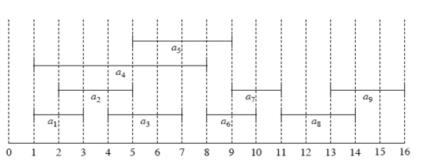

# WEEK 4 
## Lecture 1
Date : September 11, 2021, Saturday

Topic of Discussion : Greedy Choices

# Basic Greedy Design :
* Greedy choice Property 
    * Can we know one-first-step towards the optimum solution 
* Optimum substructure Property 
    * Once the first-step is taken, can we re-state the rest of the problem as a smaller version of the original problem?


By using the above two properties we can arrive with a solution for greedy algorithm <br>
### Activity Selecttion :
Set of activities </a>

a<sub>i</sub> needs resource during period [s<sub>i</sub>, f<sub>i</sub>), which is half-open interval, where s<sub>i</sub> = start time and f<sub>i</sub> = finish time 

*Goal* : Select the largest possible set o non-overlapping (mutually compatible ) activities.


 
 Maximum-size mutually compatible set {a<sub>1</sub>, a<sub>3</sub>, a<sub>6</sub>, a<sub>8</sub>}.

 Not unique : also {a<sub>2</sub>, a<sub>5</sub>, a<sub>7</sub>, a<sub>9</sub>}



So by hypothesis the answers raised the questions raised at the start can be tried to answer as below :

* Greedy choice Property 
    * Can we know one-first-step towards the optimum solution ?
        * In this case, which of the n activities is guarenteed to b in some solution?
* Optimum substructure Property 
    * Once the first-step is taken, can we re-state the rest of the problem as a smaller version of the original problem?
    * In this case, all the remaining activities that are compatible, with the first choice 

**THE GREEDY CHOICE** : 
* The activity with the least finish time (say a<sub>0</sub>) belongs to some optimum solution. Why?


Let A be a maximum-size subset of mutually compatible inactivities from S. Order activities in A in monotonically increasing order of finish time

Let a <sub>k </sub> be the first activity in A

If  a <sub>k </sub> =  a <sub>0</sub>,  done( a <sub>0</sub> is used in a maximum-size subset ). Otherwise , construct   
</a> (replace a<sub>k</sub> by a<sub>0</sub>). 

### OPTIMUM STRUCTURE 
* Solve for the activity selection problem for the activities compatible with the activity a<sub>0</sub>.
    * Activities that start after a<sub>0</sub> finishes !

Greedy-activity-selector(s,f,n)

</a><br>

</a><br>

from </a> to n <br>  
    do if s<sub>m</sub> >= f<sub>i</sub><br>
        then </a> <br>
        </a><br>
return A
here a<sub>i</sub> is most recent addition in A

### HUFFMAN CODES 
What is the most economical way to write a given long string (over some alphabet) in binary ?<br>
Example : 
* Say alphabet is {A, B, C, D}
* string T is 130 million characters from the alphabet 
* The obvious choice is to use 2 bits per symbol. say codeword 00 for A , 01 for B, 10 for C, 11 for D. In which case 260 megabits are needed in total.

Now for looking for a better coding solution we have come up with the Variable-length Encoding 
* Prefix-free property : no codeword can be a prefix of another coeword
    * Full binary tree representation 

<br>
<br>

However this gives us a total of 213 megabits, a 17% imrovement 

Now trying to do better we observe and data distribution and come up with some deductions as follows 
----
**THE PRECISE PROBLEM**
---- 
* Given the frequencies f<sub>1</sub>,f<sub>2</sub>, . . . , f<sub>n</sub> of n symbols , we want a tree whose leaves each corresponf to a symbol and which minimizes the overall length of the encoding<br>
</a><br>

Now comming to the ***Greedy choice***
* the two symbols with the smallest frequencies must be at the bottom of the optimal tree, as children of the lowest internal node. Why???
*Ans* : Otherwise, swapping these two symbols with whatever is lowest in the tree would improve the encoding!

----
#### OPTIMUM SUB-STRUCTURE
----
* define the frequency of any internal node to be the sum of teh frequencies of its descendant leaves
* the cost of a tree is the sum of the frequencies of all leaves and internal nodes, except the root

Any tree in which f<sub>1</sub> and f<sub>2</sub> are sibling-leaves has cost f<sub>1</sub> +  f<sub>2</sub> plus the cost for a tree with (n-1) leaves of frequencies (f<sub>1</sub> + f<sub>2</sub>), f<sub>3</sub>, f<sub>4</sub>, ..., f<sub>n</sub><br> 
<br>


----
ALGORITHM FOR HUFFMAN CODING
----

```
procedure Huffman(f)<br>
Input : An array f[1,...n] of frequencies <br>
Output : An encoding tree with n leaves <br>

let H be a priority queue of integers, ordered by f<br>
for i = 1 to n : insert(H, i)<br>
for k = n+1 to 2n-1 :
    i = deletemin(H), j = deletemin(H)
    create a node numbered k with children i, j
    f[k] = f[i] + f[j]
    insert (H, k)

```
----
## ENTROPY 
----
Information and optimum-encoding <br> 
more compressible = less random = more predictable <br>
Suppose there are n possible outcomes, with probabilities p<sub>1</sub>, p<sub>2</sub>, ..., p<sub>n</sub><br>  
for simplicity assume these are exactly the observed frequencies, and moreover that the p<sub>i</sub>'s are all of the form 1/2<sup>k</sup>.

What is the number of bits neededd to encodde the sequence of m values drawn from the distribution ?<br>
</a><br>
Thus the average number of bits needed to encode a single draw from the distribution is 
<br></a><br>
THis is the entropy of the distribution, a measure of how much randomness it contains

----
SUMMARY 
----
        * Greedy Choice & Optimum Sub-structure
        * Two exemplary problems 
            * Activity Selection 
            * Huffman Coding

----