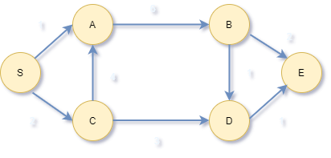
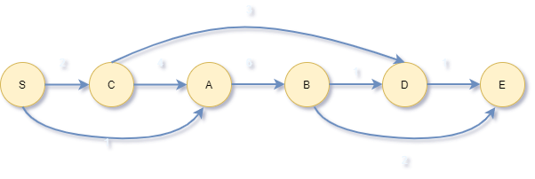
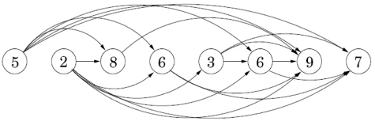

# WEEK 5
## Lecture 1
Date : September 15, 2021, Saturday

Topic of Discussion : Greedy Algorithms, Set Cover, Approximation Algorithms

### Greedy Algorithms 
* We reviewed the minimum spanning tree and used the CUT attribute to learn how local decisions match global optimizations. We also found a Kruskal algorithm that is superior to the Prim algorithm.
* We can see that the maximum spanning tree has been reduced to the minimum spanning tree.
* The activity selection problem indicates that there is an ideal greedy solution if the problem is found to follow the greedy selection and optimal substructure attributes. Perform the first step to recurse or optimize and iterate.
* Then you can see that Huffman code is another example of a greedy solution. You can see that the two least frequent nodes are siblings of the deepest internal node.

### What happens if greedy doesn't give global optimum but a local maximum?

Try a greedy approximation. It does not always give the best solution, but we compare greed with ideals and form as close an approximation as possible.

We will discuss NP-hard theory in a later course.

### SET COVER PROBLEM


The maximum spanning tree algorithm is simple-just apply the minimum spanning tree to the negative edges and deny the final answer (which may not be the case).
It can be applied to all greedy strategy algorithms such as Kruskal's method.
The above algorithm works even if you use a 2 second compliment (maximum weight-consider weights) and don't reject it.

</a>

Given set B, there are subsets S1, S2, S3, S4 ... <br>
To select Si whose union is B, we need to find A. Where the cost is the number of sets selected.<br>
This is an npr issue.<br>
**Examples of our lives:**
To build a school in a city, you need to study how schools should be arranged to make it happen.<br>
It can be used by all children, but the number of schools should be kept to a minimum.<br>
This can be replaced with another example. Instead of a school, you can use an airline, etc.<br>

        Cover B = {1,2,3,4,5,6}
        Set Family --> {1,2,3,4}
                       {1,3,5}
                       {2,4,6}
        Greedy solution : 3 sets are picked !!!
                        {1,2,3,4}
                        {1,3,5}
                        {2,4,6}
        Optimum solution : Only 2 sets are picked 
                            {1,3,5}
                            {2,4,6}


### Naive Algorithm 

Try all combinations of all the subsets(2^n),
Pick the ones whose union is the set B,
And then pick the one which contains minimum number of sets in the selection. <br>
This is an exponential algorithm.This could be quite close to the best algorithm. <br>
Completeness theory is not only for np class but also for p class,so for every class there is a completeness theory,
which means if we solve a np complete problem,we are solving the entire class of that problems. <br>
Set Cover problem is np complete-transitively very significant.
<br>

### Algorithm 
Use greedy algorithms-they don't always offer the best solution, but they are very common and fast.
One-line greedy algorithm:
  Select the set Si with the highest number of uncovered elements and repeat until all the elements in B are covered.
Probably not the minimum cover.
*Example when greedy is optimum:*
The first choice is usually the one that contains the most elements, as nothing has been selected before.<br>
From then on, the second option can be anything as long as it has the highest number of uncovered elements.<br>
**Result = 4.** <br>
 ### Is this solution - optimum ?
***Can we get an answer 3 ?-No*** for the given example.
In the example given, a greedy strategy is best, but not always.
Example when greed is not optimal:
The following is an example that proves that greed is not always the best.

```
Example : {arid, dash, drain , heard , lost  , nose, shun, slate , snare, thread, lid, roast}
B = {a,d,e,h,i,l,n,o,r,s,t,u}
Greedy Strategy :
                        Picked              Left
First Pick              thread              ilnosu
Second Pick             lost                inu
Third Pick              drain               u
Forth Pick              Shun                "NULL"

Optimum Solution :
                        Picked              Left
First Pick              Shun                adeilort (mandatory !!)
Second Pick             arid/drain          elot 
                        lid                 aeort (for picking "i" --> e & i are never together)
Third Pick              We must need two more rows to continue
Forth Pick              We must need two more rows to continue


Here By we can say Greedy is Optimum But not always for sure
```

#### In general how good is greedy strategy compared to optimum.?
Generally speaking, in a set B containing n elements,
If the optimal solution contains k sets
Second, for greedy solutions up to ***k.ln(n){base e}.*** <br>
The more complex and complex the proof, the better the proof and the better the boundaries.<br>
**Simple proof of approximation:**

Let n<sub>t</sub> Number of elements <br>
            --> not covered after "t" iterations <br>
    n<sub>0</sub> = 0 Starting point <br>

Remaining elements are covered by optimal k sets --> some set must have atleast *n/k* elements <br>
Here we dont know how greedy works so let us take the worst case <br>
SInce in greedy . it takes max number uncovered elements <br>
n<sub> t+1 </sub> <= n<sub> t </sub> - n<sub> t/k </sub> <br>
                     n<sub> t(1-1/k) </sub><br>
n<sub>t</sub> <= n<sub> 0(1-1/k)<sup>t</sup> </sub> <br>
we know 1-x <= e<sup>-x</sup> for all x <br>
where "=" at x=0 and for all other x it will be "<" <br>
n<sub>t</sub> <= n<sub> 0(1-1/k)<sup>t</sup> </sub> < n<sub> 0</sub> (e<sup> -1/k</sup>)<sup>t</sup> = ne<sup>-t/k</sup>  
Hence at t = k ln(n)
n<sub>t</sub> < n.e<sup>-ln(n)</sup> = 1 <br>
                --> strictly
###  Dedutions made from the Lecture
Now we know that:<br>
if greedy works-it gives optimum solution, <br>
if doesnt work-it still gives a solution with a bound.(not always an optimum but its better) <br>


----
## Lecture 2
----
Date : 18th September 2021<br>
Topic of Discussion : DYNAMIC PROGRAMMING (shortest path in DAGs & Longest Increasing Subsequence) <br>

----
### Review
----
* Minimum Spanning tree
* Activity selection
* Huffman codes
* Set cover & Approximation

----
### SHORTEST PATH
----
we here consider In Directed Acyclic Graph <br>
**Topological Sorting** <br><br>
 <br>
 <br>

---
### Dist (far-nodes) from Dist (near-nodes)
----
Initialize all dist(.) values to  <br>
dist(s) = 0 <br>
for each  , in linearized order : <br>
          <br><br>
 <br>

**What about longest path in DAGs???**<br>
--> Dynamic Programming is just a DAG of sub-problems!<br>

----
### Longest increasing sequence (LIS)
----
Input is a sequence of numbers a<sub>1</sub>, ...., a<sub>n</sub><br>
A subsequence is :<br>
              a<sub>i<sub>1</sub></sub>, a<sub>i<sub>2</sub></sub>, ....a<sub>i<sub>k</sub></sub><br>
              --> 1 <= i <sub>1</sub> < i <sub>2</sub> < .... < i <sub>k</sub> <= n<br>
An increasing subsequence is one in which the numbers are getting strictly larger<br>
Now here the task is to find the increasing subsequence of greatest length <br>
Considering an example in the given longest sequence of 5, 2, 8, 6, 3, 6, 9, 7 the longest increasing subsequence will be 2,3,6,9<br>

Now lets try to create a graph of all permissible transitions <br> 
* establish a node i for each element a<sub>i</sub> , and add directed edges (i, j) whenever it is possible for a<sub>i</sub> and a<sub>j</sub> to be consequetive elements in an increasing subsequence, that is , whenever i < j and a<sub>i</sub> < a<sub>j</sub>

 <br>

### What are the DAG of sub-problems?
L(j) is the length of the longest path - the longest increasing subsequence - ending at j <br>
collection of sub-problems {L(j) : 1 <= j <= n}<br>
L(j) = 1 + max{L(i) : (i, j) in E }
* Note : **Dynamic Programming** : There is an ordering on the subproblems, and a relation that shows how to solve a sub problem given the answers to smaller subproblems, that is, subproblems that appear earlier in the ordering.<br>
----
### THE ALGORITHM
----
```
for j = 1,2,...n:
    L(j) = 1 + max{L(i) : (i, j) in E}
return max_j(L_j)
```
