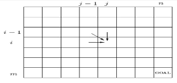
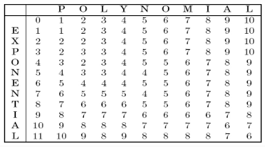
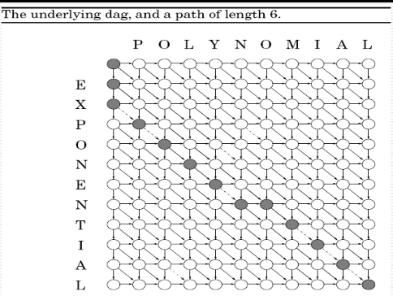
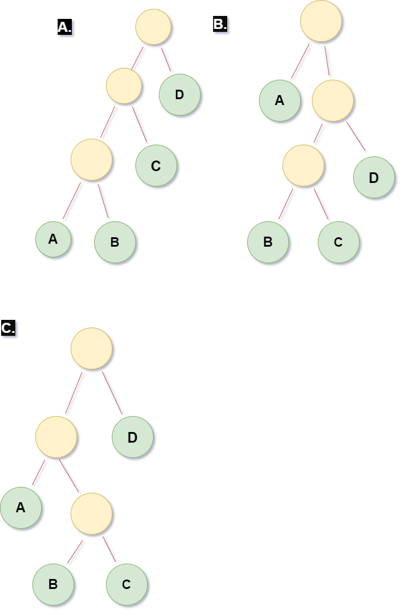

----

Date : 24<sup>th</sup> september 2021, Wednesday <br> 
Topic of Discussion : Dynamic Programming (Edit Distance) <br>

----


----

* Shortest Path in DAG's
* Longest Increasing subsequence

----


----

Between two words : The minimmum number of Insert / Delete / Overwrite to convert one word to another
## Problem : 
A natural measure of the distance between two springs is the extent to which they can be aligned, or matched up. For instance, an alignment, or matched up. For instance , an alignment of SNOWY and SUNNY : <br>

<br><br>

<br><br>
Cost : 5<br><br>
 <br><br>
 <br><br>
Cost : 3 <br><br>

----


----

Goal here is to find the edit distance between two strings x[1,2,....m] and y[1,2,....n]

* Here we consider subproblems to solve this problem  
subproblem E(i,j)<br>
edit distance between some prefix of the first string , x[1.....i] and some prefix of the second , y[1....j] <br>

## Expressing E(i, j) in terms of smaller sub-problems
Rightmost column can only be one of the tree strings :<br><br>
<br><br>
**E(i,j) = min{1+ E(i-1, j), 1+ E(i, j-1), diff(i, j) + E(i-1, j-1)}**<br>
diff(i,j) is defined to be "0" if x[i] = y[i] and "1" otherwise<br>
The answers to all the subproblems can be deduced by E(i,j) form a two-dimensional table <br><br>
<br><br>
* In what order should these sub-problems be solved ? E(i-1, j) , E(i, j-1), E(i-1, j-1) are to be handed before E(i, j)<br>

### Algorithm 
```
for i = 0,1,2,....m :
    E(i,0) = i
for j = 1,2,.....n :
    E(0,j) = j
for i = 1,2,3,...m :
    for j = 1,2,3...m :
        E(i,j) = min{E(i-1,j) + 1 , E(i, j - 1) + 1, E(i - 1, j - 1) + diff(i, j)}
return E(m,n)
```

### Example : 
<br><br>
<br><br><br><br>

<br><br>

----


----

Edit distance between x[1,2,...n] and y[1,2,....m] in time : O(mn) <br>

----


Date : 25th September 2021, Saturday<br>
Topic of Discussion : Chain Matrix multiplication and KNAPSACK<br> 

----


----

* Shortest Path in DAG's
* Longest Increasing subsequence
* Edit distance 

----


**Problem** :

Suppose that we want to multiply four matrices A, B, C, D of dimensions 50 X 20 , 20 X 1, 1 X 10, 10 X 100<br>
Multiplying an m x n matrix by an n x p matrix takes *mnp* multiplications<br>


<table class="tg">
<thead>
  <tr>
    <th class="tg-68ks"><span style="font-weight:normal;color:#FFF">Paranthesization</span></th>
    <th class="tg-68ks"><span style="font-weight:normal;color:#FFF">Cost computation</span></th>
    <th class="tg-03cz"><span style="font-weight:normal;color:#FFF">cost</span></th>
  </tr>
</thead>
<tbody>
  <tr>
    <td class="tg-03cz"><span style="color:#FFF">A X ((B X C) X D)</span></td>
    <td class="tg-03cz"><span style="color:#FFF">20.1.10 + 20.10.100 + 50.20.100</span></td>
    <td class="tg-03cz"><span style="color:#FFF">120,200</span></td>
  </tr>
  <tr>
    <td class="tg-03cz"><span style="color:#FFF">(A X (B X C)) X D</span></td>
    <td class="tg-03cz"><span style="color:#FFF">20.1.10 + 50.20.10 + 50.10.100</span></td>
    <td class="tg-03cz"><span style="color:#FFF">60,200</span></td>
  </tr>
  <tr>
    <td class="tg-03cz"><span style="color:#FFF">(A X B) X (C X D)</span></td>
    <td class="tg-03cz"><span style="color:#FFF">50.20.1 + 1.10.100 + 50.1.100 </span></td>
    <td class="tg-03cz"><span style="color:#FFF">7,000</span></td>
  </tr>
</tbody>
</table>

How to determine the optimal order?<br>
A .  ((A X B) X C) X D<br>
B .  A X ((B X C) X D) <br>
C .  (A X (B X C)) X D   <br>
<br><br>
<!--  -->

<br><br>

----

<br><br>

Binary trees are suggestive: for a tree to be optimal, its subtrees must also be optimal<br>
C(i, j) = minimum cost of multiplying A<sub>i</sub> * A<sub>i + 1</sub> * ..... *  A<sub>j</sub><br> 
C(i, j) = 0<br><br><br>
<br><br>

### Algorithm :
```
for i = 1 to n : C(i,j) = 0
for s = 1 tp n-1:
    for i = 1 to n-s:
        j = i + s
        C(i,j) = min{C(i,k)+ C(k+1,j)+ m_{i-1}.m_k.m_j : i <= k < j} 
return C(1,n)
```

----

<br><br>

The subproblems constitute a two-dimensional table, each of whose entries takes O(n) time to compute. The overall running time is thus O(n<sup>3</sup>)<br>


----
----

<br><br>

**Problem** : <br> 
During a robbery , a bulgar finds much more loot than he had expected and has to decide what to take. His bag (or .knapsack) will hold a total weight of atmost W units. There are n items to pick form , of weight w<sub>1</sub>, ...., w<sub>n</sub> and dollar value v<sub>1</sub>, ...., v<sub>n</sub><br>  

* here we tend to find the most valuable combination of items he can fit into his bag ??
<table class="tg">
<thead>
  <tr>
    <th class="tg-68ks"><span style="font-weight:normal;color:#FFF">Item</span></th>
    <th class="tg-68ks"><span style="font-weight:normal;color:#FFF">Weight</span></th>
    <th class="tg-03cz"><span style="font-weight:normal;color:#FFF">Value</span></th>
  </tr>
</thead>
<tbody>
  <tr>
    <td class="tg-03cz"><span style="color:#FFF">1</span></td>
    <td class="tg-03cz"><span style="color:#FFF">6</span></td>
    <td class="tg-03cz"><span style="color:#FFF">$30</span></td>
  </tr>
  <tr>
    <td class="tg-03cz"><span style="color:#FFF">2</span></td>
    <td class="tg-03cz"><span style="color:#FFF">3</span></td>
    <td class="tg-03cz"><span style="color:#FFF">$14</span></td>
  </tr>
  <tr>
    <td class="tg-03cz"><span style="color:#FFF">3</span></td>
    <td class="tg-03cz"><span style="color:#FFF">4</span></td>
    <td class="tg-03cz"><span style="color:#FFF">$16</span></td>
  </tr>
  <tr>
    <td class="tg-03cz"><span style="color:#FFF">4</span></td>
    <td class="tg-03cz"><span style="color:#FFF">2</span></td>
    <td class="tg-03cz"><span style="color:#FFF">$9</span></td>
  </tr>
</tbody>
</table>
<br>W = 10<br><br>

### KNAPSACK with Repetition:
K(w) = maximum value achievable with a knapsack of capacity w<br>
* Can we express this in terms of smaller subproblems?
<br><br><br><br>

#### Algorithm :
```
K(0) = 0
for w = 1 to W :
    K(w) = max{K(w-w_i)+v_i : w_i <= w}
return K(W)
```

K(w,j) = maximum value achievable using a knapsack of capacity w and items 1, ..., j<br>
How can we express a subproblem K(w,j) in terms of smaller sub-problems? Quite simple - either item j is needed to achieve the optimal value, or it isn't needed :<br><br>
<br><br>

#### Algorithm :
```
Initialize all K(0,j) = 0 and all K(w,0) = 0
for j = 1 to n :
    for w = 1 to W :
        if w_j > w : K(w,j) = K(w, j-1)
        else : K(w,j) = max{K(w,j-1), K(w-w_j, j-1)+v_j}
return K(W,n)
```

----
----

<br><br>

* O(n<sup>3</sup>) algorithm for chain matrix multiplication
* O(nW) algorithm for knapsack

----