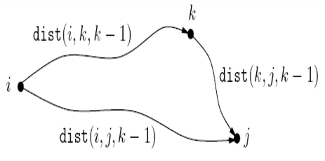
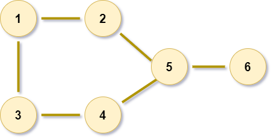

----

Date : 29<sup>th</sup> september 2021, Wednesday <br> 
Topic of Discussion : Shortest Reliable Paths FLOYD-WARSHALL Algorithm and Independent set in Trees  <br>

----


----

* Shortest Path in DAG's
* Longest Increasing subsequence
* Edit Distance
* Chain Matrix multiplication
* Knapsack

----

<br>

Suppose then that we are given a  graph G with lenghts on edges, along with two nodes s and t and an integer k, and we want the shortest path from s to t that uses at most k edges.<br>
**A Dynamic Programming Solution:** <br>
i <= k, dist(v,i) to be the length of the shortest path from s to v that uses i edges<br>
<br><br>

<br><br>

----
----

<br>

**FLoyd-Warshall Algorithm O(|v|^3)**<br>
Let dist(i,j,k) denote the lenght of the shortest path from i to j in which only nodes {1,2,...k} can be used as intermediates.<br>
**dist(i,j,k) = min{dist(i,k,k-1)+dist(k,j,k-1),dist(i,j,k-1)}**<br>
<br><br><br><br>

----
### FLoyd-warshall algorithm
```
for i = 1 to n:
    for j = 1 to n:
        dist(i,j,0) = infinity
for all (i,j) belongs to E:
    dist(i,j,0) = l(i,j)
for k = 1 to n:
    for i = 1 to n:
        for j =1 to n:
            dist(i,j,k)=min{dist(i,k,k-1)+dist(k,j,k-1),dist(i,j,k-1)}
```

----

<br>
> Problem : <br>
A subset of nodes S of V is an independent set of graph G = (v,E) if there are no edges between them<br> 
The largest independent set in this graph has size 3<br><br><br><br><br>
> Question : <br>
What is the largest independent set , given a tree T ?<br>
I(u) = size of the largest independent set of subtree hanging from u <br>
How can we compute I(u)? Let's split the computation into two cases : any independent set either includes u or it dosent<br><br><br><br><br>

----

<br>

* Dynamic programming solutions for shortest reliable paths and largest independent sets in trees
* Floyd-warshall algorithm

----