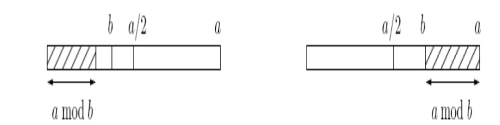
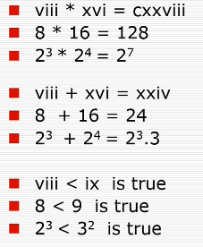
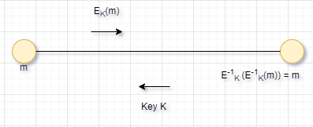

----
<br><br>
Date : 9<sup>th</sup> October 2021, Saturday <br> 
Topic of Discussion : Number theoretic algorithms  <br>

----

<br>


```
function Euclid (a,b)
Input : Two integers a and b with a >= b >= 0
Output : gcd(a,b)

if b = 0 : return a  
return Euclid(b, a mod b) 
```

If x and y are positive integers with x >= y, then gcd(x,y) = gcd(x mod y, y)<br>
Proof : It is enough to show the slightest simpler rule gcd(x,y) = gcd(x-y, y) from which the one stated can be derived by repeatedly subtracting y from x.<br>
Here it goes. Any integer that divides both x and y must also divide x-y , so gcd(x-y) <= gcd(x-y, y). Likewise , any integer that divides both x-y and y must also divide both x and y, so gcd(x,y) >= gcd(x-y, y).<br>

----

<br>

Lemma If a >= b , then a mod b < a/2 <br>
**Proof :** <br>
Witness that either b <= a/2 or b > a/2 . These two cases are shown in  the following figure. If b <= a/2 , then we have a mod b < b <= a/2; and if b > a/2 , then a mod b = a - b < a/2<br>  
<br><br><br><br>

----

<br><br>

**Lemma** : If d divides both a and b , and d = ax + by for some integers x and y , then necessarily d = gcd(a,b)<br>
**Proof** : By the first two conditions , d is a common divisor of a and b and so it cannot exceed the greatest common divisor , that is , d <= gcd(a,b) . On the other hand , since gcd(a, b) is a common divisor of a and b , it must also divide ax + by = d, which implies gcd(a,b) <= d . Putting these together , d  = gcd(a, b).<br>

####  Procedure to find x and y :
for gcd(25,11) : <br>
```
25 = 2.11 + 3
11 = 3.3 + 2
3 = 1.2 + 1
2 = 2.1 + 0
```

```
function extended - Euclid (a, b):
Input : Two positive integers with a and b with a >= b >= 0
Output : Integers x, y, d such that d = gcd(a,b) and ax + by = d

if b = 0 : return (1,0,a)
(x', y', d) = Extended - euclid (b, a mod b)
return (y', x'-[a/b]y', d)
```

**Lemma :**<br>
For any positive integers a and b, the Extended Euclid algorithm returns x, y and d such that gcd(a,b) = d = ax + by<br>
**Inducitve Hypothesis :**<br>
```
gcd(b, a mod b) = bx' + (a mod b)y'
```
Writing (a mod b) as (a - [a/b]b) we find <br>
d = gcd(a,b) = gcd(b, a mod b) = bx' + (a mod b)y' = bx' + (a - [a/b]b)y' = ay' + b(x' - [a/b]y')<br> 
We say x is the multiplicative inverse of a modulo N if <br><br> <br><br>
**Modular division theorem :**<br>
For any a mod N , a has a multiplicative inverse modulo N if and only if it is relatively prime to N. When the inverse exists , it can be found in time O(n<sup>3</sup>)(where as usual n denotes the number of bits of N ) by running the extended Euclid algorithm <br>
**Example :**<br>
Continuing with our previous example , suppose we wish to compute 11 <sup>-1</sup> mod 25 . using the extended euclid algorithm , we find that 15.25 - 34.11 = 1. Reducing both sides modulo 25 , we have <br><br><br><br>. So  is the inverse of 11 mod 25 <br><br> 

----

<br>

**How to publish the key and yet to be secure ?**<br>
**Ease / Speed of operation depends on the representation**<br>
<br><br><br><br>
<br><br>

<table class="tg">
<thead>
  <tr>
    <th class="tg-68ks"><span style="font-weight:normal;color:#FFF">        </span></th>
    <th class="tg-68ks"><span style="font-weight:normal;color:#FFF">Addition</span></th>
    <th class="tg-03cz"><span style="font-weight:normal;color:#FFF">Multiplication</span></th>
    <th class="tg-03cz"><span style="font-weight:normal;color:#FFF">Comparision</span></th>
  </tr>
</thead>
<tbody>
  <tr>
    <td class="tg-03cz"><span style="color:#FFF">Roman</span></td>
    <td class="tg-03cz"><span style="color:#FFF">Slow</span></td>
    <td class="tg-03cz"><span style="color:#FFF">Slow</span></td>
    <td class="tg-03cz"><span style="color:#FFF">Slow</span></td>
  </tr>
  <tr>
    <td class="tg-03cz"><span style="color:#FFF">Decimal</span></td>
    <td class="tg-03cz"><span style="color:#FFF">fast</span></td>
    <td class="tg-03cz"><span style="color:#FFF">Medium</span></td>
    <td class="tg-03cz"><span style="color:#FFF">fast</span></td>
  </tr>
  <tr>
    <td class="tg-03cz"><span style="color:#FFF">Prime Product</span></td>
    <td class="tg-03cz"><span style="color:#FFF">Slow</span></td>
    <td class="tg-03cz"><span style="color:#FFF">Fast</span></td>
    <td class="tg-03cz"><span style="color:#FFF">Medium</span></td>
  </tr>
  <tr>
    <td class="tg-03cz"><span style="color:#FFF">Residue System</span></td>
    <td class="tg-03cz"><span style="color:#FFF">Fast</span></td>
    <td class="tg-03cz"><span style="color:#FFF">Fast</span></td>
    <td class="tg-03cz"><span style="color:#FFF">Medium</span></td>
  </tr>
</tbody>
</table>
<br><br>

**Sometimes Slowness is also advantageous**

----

<br>

<br><br><br><br>
In representation R<sub>2</sub> : <br>

*  Operation E <sub>K</sub> is Fast
*  Operation E <sub>K</sub><sup>-1</sup> is Very Slow

In representation R<sub>1</sub> : <br>

*  Operation E <sub>K</sub><sup>-1</sup> is Fast


Example RSA Cryptosystem : <br>

*   R <sub>1</sub> : Product of primes
*   R <sub>2</sub> : Decimals
*   E <sub>K</sub> : Modular Exponentation m <sup>e</sup> mod K

----

<br><br>

* Pick any two primes p and q and let N = pq<br>
* For any e relatively prime to (p-1)(q-1) :
    * The mapping f(x) = x^e mod N is a bijection on {0, 1 , .... N-1}  
    * Moreover, the inverse mapping is easily realized : 
        * Then for all x in {0, 1, ... N-1}
              (x <sup>e</sup>)<sup>d</sup> mod N = x mod N <br>
              x <sup>ed</sup> - x = x <sup>1 + k(p-1)(q-1)</sup> - x <br>
is always 0 modulo N. The second form of the expression is convenient because it can be simplified using Fermat's little theorem. It is divisible by p (since ) and likewise by q. Since p and q are primes , this expression must also be divisible by their product N. Hence <br>
<br>, exactly what we need.

### Fermat's little theorem : 
<br>
The numbers a . i mod p are distinct because if <br>,
then dividing both sides by a gives  . They are non-zero because  similarly   (And we can divide by a , because by assumption it is non-zero and therefore relatively prime to p).<br>
<br>

----

<br>

* Euclid's G.C.D.
* Modular Division
* Fermat's Little theorem
* RSA cryptosystem

----